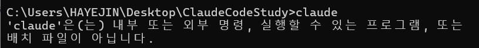
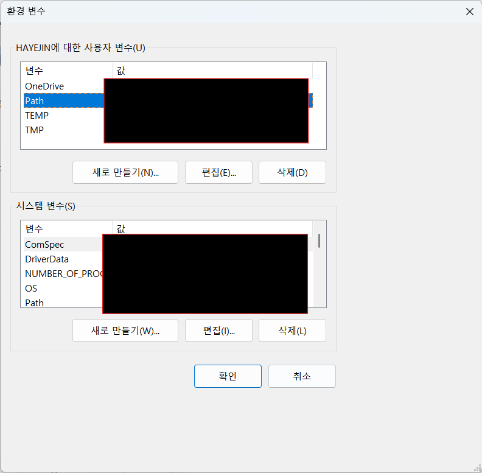
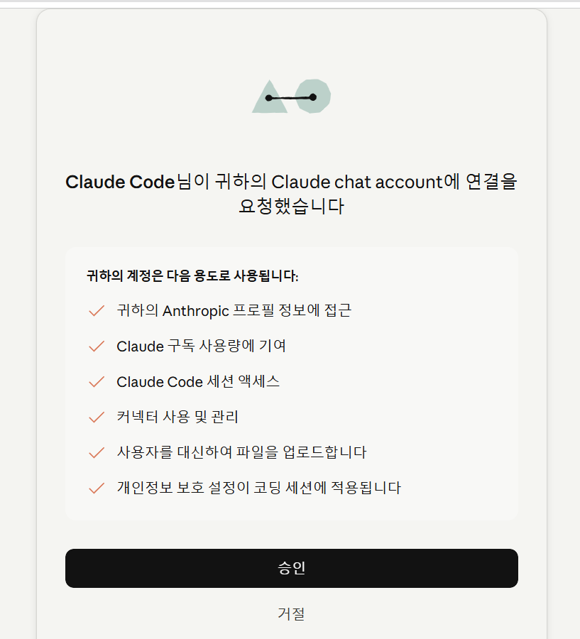
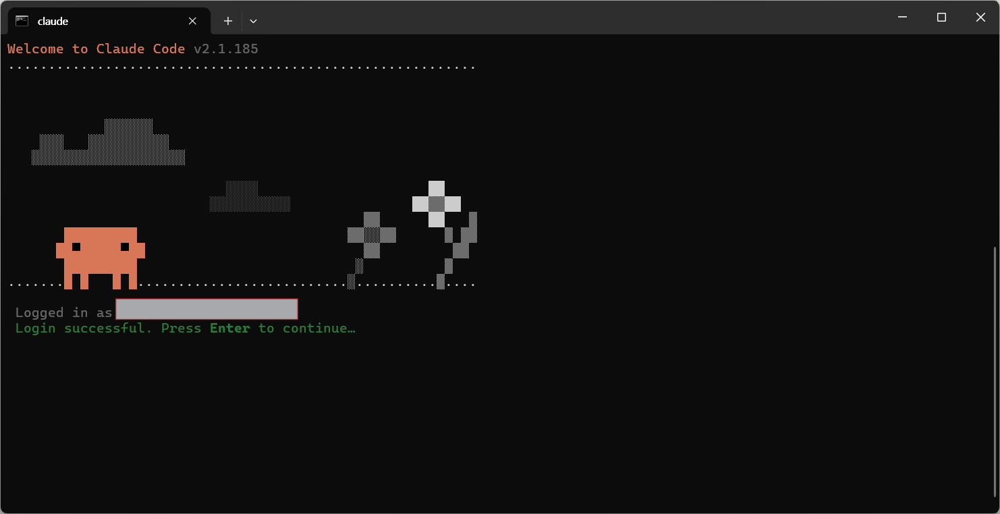
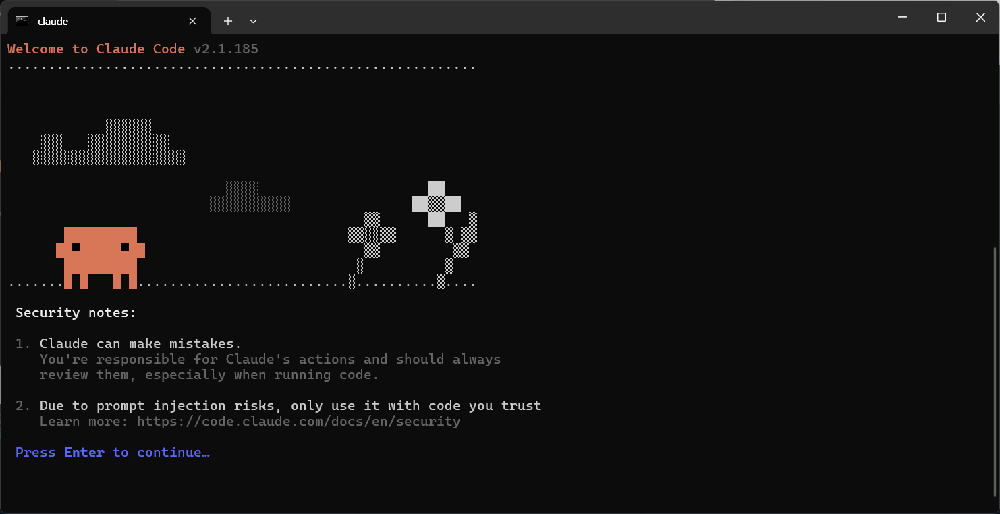
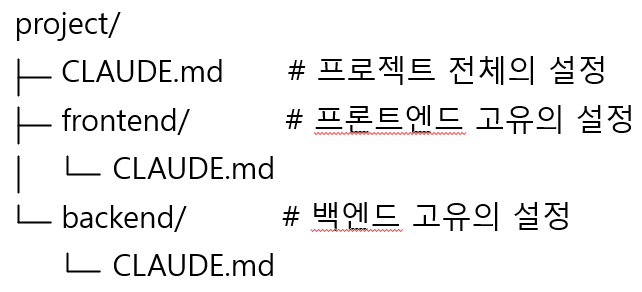
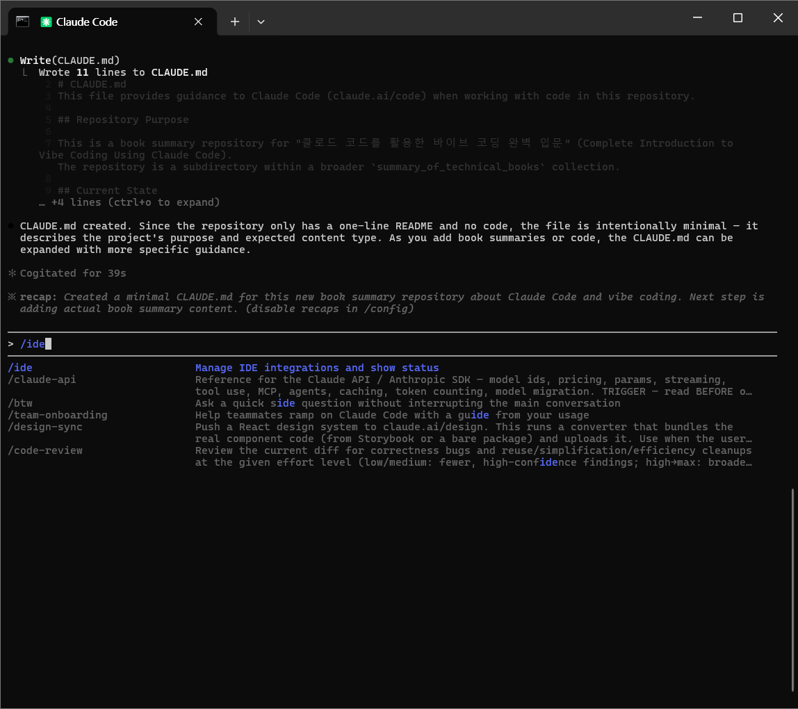
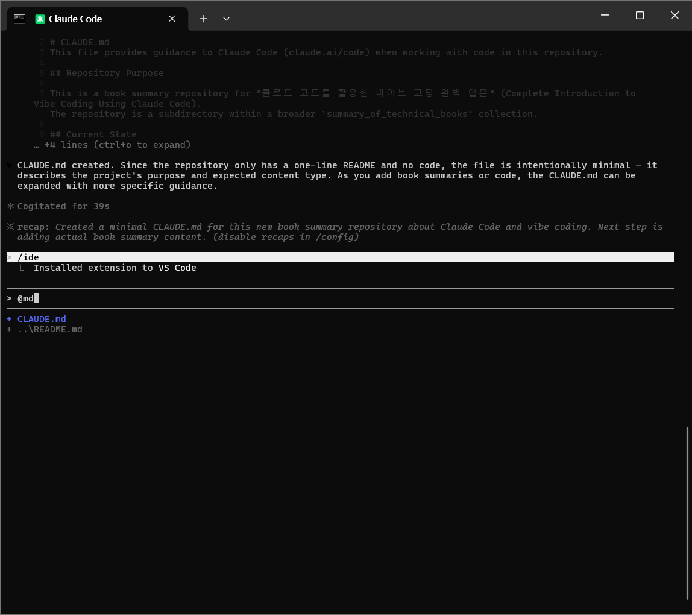
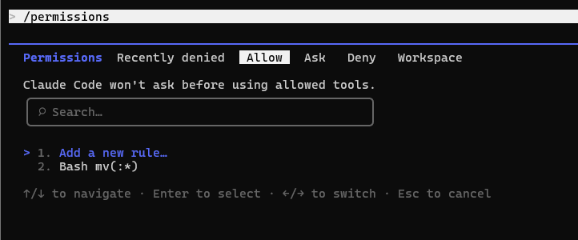

# 클로드 코드를 활용한 바이브 코딩 완벽 입문

# [1장] 클로드 코드 입문과 개발 환경 구축

- 클로드 코드 : 앤트로픽사가 개발한 CLI에서 작동하는 AI 코딩 에이전트
- 클로드 코드 특징
    1. 멀티파일, 멀티태스크 대응
    2. 병렬 실행 능력
    3. 자연어를 통한 대화형 개발
    4. 실행 환경과의 깊은 통합
    5. 환경에 의존하지 않음
- 클로드 코드 콘솔을 사용하기 위해선 구독 or API 종량제 중 하나를 선택해야 된다.

## 클로드 코드 설치

- Windows 용 클로드 코드 설치 명령어
    
    ```bash
    curl -fsSL https://claude.ai/install.cmd -o install.cmd && install.cmd && del install.cmd
    ```
    
- 설치 후 cmd에 `claude` 를 입력하면 클로드 코드가 시작된다.
    - 만약 `claude`를 입력해도 시작되지 않는다면 시스템 변수에 값을 추가한다.
        
        
        
    - C:\Users\내이름\\.local\bin 하단에 claude.exe 파일이 정상적으로 존재하는지 확인 후 시스템 변수 `Path` 하단에 해당 변수를 추가한다.
        
        
        
- cmd에서 Claude 를 실행한 뒤 계정을 연결하면 다음 이미지와 같이 나온다.
    
    
    
    
    
- 계정 연결 후 주의사항을 알려준다
    - Claude can make mistakes(클로드는 실수를 할 수 있다.)
    - Due to prompt injection risks, only use if with code you trust(프롬프트 인젝션 위험이 있으므로 신뢰할 수 있는 코드만 사용해야 한다.)
        
        
        
- 해당 파일(경로)을 신뢰하며 CRUD를 허용하는지 확인한다.
    

## 기본 명령어 정리

- `/init` 명령어
    - **"지금 내가 열어놓은 프로젝트 폴더**(지금 디렉토리)**를 분석해서 CLAUDE.md를 만들어줘"**라는 명령어
    - 또는 `/init src 폴더만 분석해서 CLAUDE.md에 반영해줘` 프롬프트를 통해 동일한 행위를 실행할 수 있다.
        
        
- `/init`으로 생성된 Claude.md : 클로드 코드의 메모리 역할을 한다.
    - 프로젝트 루트 뿐만 아니라 하위 디렉토리에도 CLAUDE.md를 배치할 수 있다.(즉, CLAUDE.md가 여러개가 존재할 수 있다.)
        
        
        
    - 모든 클로드 코드 실행에 공통 규칙을 사용하려면 프로젝트의 루트 디렉토리 아래 .claude 폴더에 CLAUDE.md를 추가하면 된다.
    - 폴더 주요 구성 요소
        - **`CLAUDE.md`** : Claude가 세션 시작 시 가장 먼저 읽는 핵심 지침 파일. 빌드/테스트 명령어, 핵심 아키텍처 규칙, 코딩 컨벤션 등을 기록
        - `rules/` 폴더 : `CLAUDE.md`가 너무 길어질 때 관심사별(보안, API, 테스트 등)로 규칙을 분리하는 마크다운 폴더. YAML 프론트매터의 `paths` 필드로 특정 파일 경로에만 규칙을 적용할 수도 있습니다
        - `commands/` 폴더 : 마크다운 파일 이름이 슬래시 명령어(예: `/project:review`)로 등록되는 사용자 정의 커맨드 폴더
        - `skills/` 폴더: 지정된 상황이나 대화 맥락을 파악하여 Claude가 스스로 판단하고 실행하는 자동화 워크플로 폴더
        - `agents/` 폴더: 특화된 작업(예: 코드 리뷰어)을 수행하도록 별도의 툴킷과 모델, 시스템 프롬프트를 부여하는 서브 에이전트 정의 폴더
        - `settings.json`: 권한의 경계를 정하는 설정 파일. 자동 실행할 명령(allow)과 차단할 명령(deny)의 목록을 지정
- 클코드 코드와 IDE 연결하기
    - `/ide` 명령어를  통해 로컬에 설치되어있는 ide와 연결하여 편리하게 사용할 수 있다.
    - 연결 후 IDE에서 특정 파일을 열거나 커서를 대면 Claude 콘솔 우측 하단에 편집 중인 파일에 대한 정보가 나온다.
        
        
        
- `@` 를 입력하면 파일을 지정하여 명령을 내릴 수 있다.
    - ex. `이 파일의 코드 내용을 알려주세요. @src/component/reports/ReportSearchForm.tsx`
        
        
        
- [ESC] 버튼을 통해 실행을 중지할 수 있다.
- 이전 내용 이어서 대화하기
    
    ```bash
    # 이전 대화에서 계속하기
    claude --continue
    claude -c
    # 과거의 세션 목록에서 선택하여 재개
    claude -resume
    ```
    
    - `/resume` : 대화모드
- 채팅 기록 확인
    - [ESC] 를 두번 누르기
    - `/rewind`
- 메모리에 즉시 추가
    - [CLAUDE.md](http://CLAUDE.md) 에 즉시 기억 내용을 추가하고 싶으면 `#` 명령으로 추가할 수 있다.
- 클로드는 사용자의 지시에 대해 자체적으로 실행 계획을 수립하고 실행하는 경우가 있다.
그 경우 계획을 생략하여 표시하는 경우가 있으며 “ctrl + t to show todos” 라고 표시된다.

## 권한

- 명령 실행을 허가할 경우 프로젝트 루트에 .cluade 디렉토리에 settings.local.json 설정 파일에 다음과 같이 추가하면 된다.
    
    ```json
    {
    	"permissions" : {
    		"allow" : [
    			"Bash(mv:*)"
    		]
    	}
    }
    ```
    
    - 아니면 `/permissions` 명령을 통해 CLI에서 권한을 추가할 수 있다.
        
        
        
- 권한 작성 방법
    
    ```bash
    Bash # 모든 실행 
    Bash(*) # 임의의 bash 명령
    Bash(npm:*) # "npm"으로 시작하는 모든 명령 허용
    ```
    
- 권한모드
    
    
    | 모드 | 설명 | 추가 설명 |
    | --- | --- | --- |
    | default | 각 도구를 처음 사용할 때 권한 요청(기본값) | 사용자의 동의 없이 파일을 임의로 수정하지 않는다. |
    | acceptEdits | 세션에 대해 파일 편집 권한을 자동으로 수락 | `shift+tab`을 누르면 활성화됨.
    질문만 했을 뿐인데 클로드가 임의로 구현을 시작해버릴 수 있으니 주의 |
    | plane | 클로드가 분석과 계획 수립만 할 수 있고, 파일 수정이나 명령 실행을 할 수 없음 | 계획을 제안한 뒤 “ready to code?” 질문과 함께 accept, default, plane 모드 중 어떻게 실행할지 선택지를 제공한다 |
    | bypassPermissions | 모든 권한 요청을 건너뜀(안전한 환경 필요) | 세션을 시작한 이후로는 모드를 변경할 수 없으니 주의
    .claude/settings.json 설정 내 deny 항목도 무시되니 주의  |
- `claude update`를 실행하여 업데이트 진행 가능